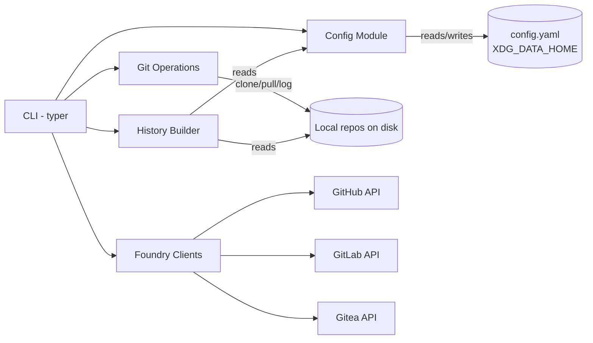

# Architecture: git-projects

## Problem and context

A developer working across multiple git foundries (GitHub, GitLab, self-hosted Gitea) loses track of what they worked on and where. There is no unified view of recent activity across all repositories. This tool provides a local-first CLI that discovers repos via APIs, tracks them locally, and generates activity summaries from git history.

## Goals and non-goals

### Goals

1. Discover repos from GitHub, GitLab, and Gitea APIs — list available repos on demand.
2. Let the user explicitly select which repos to track via config.
3. Clone and sync tracked repos locally at a configured base path.
4. Provide project list and history views from local git log.
5. Single config file (`config.yaml`) under `XDG_DATA_HOME/git-projects/` — no separate registry.

### Non-goals

- No web UI or daemon process.
- No direct API-based commit/PR fetching — all history comes from local git log.
- No support for non-git VCS.
- No automatic scheduled runs (user runs manually or via cron).
- No auto-tracking heuristics — user explicitly picks repos.

## System overview

The tool is a local CLI application. `fetch` calls foundry APIs and prints available repos (ephemeral, not persisted). `track`/`untrack` manage which repos the user cares about in `config.yaml`. `sync` clones missing and pulls existing tracked repos. `list` and `history` read from local state and git repos to produce terminal output.



## Technology stack

| Component | Technology | Version | Rationale |
|---|---|---|---|
| Language | Python | 3.12+ | Already chosen in pyproject.toml |
| CLI framework | typer | 0.12+ | Already chosen in pyproject.toml |
| HTTP client | httpx | latest | Async-capable, clean API, lighter than requests |
| Git operations | subprocess (git) | — | Avoids heavy deps like GitPython; shell out to `git` directly |
| Data storage | YAML via PyYAML | latest | Human-readable, editable config; no DB overhead |
| XDG paths | platformdirs | latest | Cross-platform XDG_DATA_HOME resolution |
| Date handling | stdlib datetime | — | No need for arrow/pendulum |

## CLI commands

| Command | Description |
|---|---|
| `config init` | Create default config file |
| `config show` | Show config file path and contents |
| `fetch [foundry]` | Fetch and print available repos from foundry APIs (not persisted) |
| `track <clone_url>` | Add a project to config.yaml (auto-derives name and path) |
| `untrack <name>` | Remove a project from config.yaml |
| `list` | Show tracked projects |
| `sync` | Clone missing repos, pull existing tracked repos |
| `history [name]` | Git log summaries for tracked projects |

### Workflow

```
fetch               → see what repos exist on your foundries
track <clone_url>   → add a repo to your tracked projects
sync                → clone & pull all tracked projects
list                → see what you're tracking
history [name]      → see recent git activity
untrack <name>      → stop tracking a project
```

## Module boundaries

### `cli` — Command-line interface
- **Owns**: Argument parsing, output formatting, subcommand dispatch.
- **Public interface**: `app` (typer instance) with commands: `config` (group: `init`, `show`), `fetch`, `track`, `untrack`, `list`, `sync`, `history`.
- **Must NOT**: Contain business logic, call git directly, or manage state.

### `config` — Configuration and project tracking
- **Owns**: Reading/writing `config.yaml`, managing the project list.
- **Public interface**: `load_config() -> Config`, `save_config(Config)`, `init_config() -> Path`, `add_project(clone_url) -> Project`, `remove_project(name) -> bool`.
- **Data types**:
  - `FoundryConfig`: `name`, `type`, `url`, `token`.
  - `Project`: `clone_url`, `name`, `path`.
  - `Config`: `clone_root`, `foundries: list[FoundryConfig]`, `projects: list[Project]`.
- **Must NOT**: Call APIs or run git commands.
- **Storage layout**:
  ```
  $XDG_DATA_HOME/git-projects/
  └── config.yaml      # foundries, clone root, tracked projects
  ```
- **Default config.yaml created by `init`**:
  ```yaml
  clone_root: ~/projects    # where repos get cloned
  foundries:
    - name: github
      type: github
      url: https://api.github.com
      token: ""              # paste your token here
    # - name: my-gitlab
    #   type: gitlab
    #   url: https://gitlab.com
    #   token: ""
    # - name: my-gitea
    #   type: gitea
    #   url: https://gitea.example.com
    #   token: ""
  projects: []
  ```
- **Example config.yaml with tracked projects**:
  ```yaml
  clone_root: ~/projects
  foundries:
    - name: github
      type: github
      url: https://api.github.com
      token: "ghp_..."

  projects:
    - clone_url: https://github.com/user/repo-a.git
      name: repo-a
      path: ~/projects/github.com/user/repo-a
    - clone_url: https://gitlab.com/user/repo-b.git
      name: repo-b
      path: ~/projects/gitlab.com/user/repo-b
  ```
- **Path derivation**: When `track` is called with a clone URL, `name` is extracted from the URL (last path segment without `.git`), and `path` is derived as `{clone_root}/{hostname}/{owner}/{repo}`.

### `foundry` — API clients for repo discovery
- **Owns**: Listing repos from GitHub, GitLab, Gitea APIs. Returns normalized repo metadata.
- **Structure**: Package with one submodule per API type (`foundry/github.py`, `foundry/gitlab.py`, `foundry/gitea.py`). Each submodule exposes the same function signature.
- **Public interface**: Each submodule exposes `list_repos(config: FoundryConfig) -> list[RemoteRepo]`.
- **Shared types**: `RemoteRepo` dataclass defined in `foundry/__init__.py` — fields: `name`, `clone_url`, `pushed_at`, `default_branch`, `visibility`, `description`.
- **Must NOT**: Clone repos, modify config, or read git history.

### `gitops` — Local git operations
- **Owns**: Cloning repos, pulling updates, reading git log.
- **Public interface**: `clone_repo(url, path)`, `pull_repo(path)`, `get_log(path, since: date | None) -> list[Commit]`.
- **Must NOT**: Call foundry APIs or write to config.

### `history` — History and changelog generation
- **Owns**: Aggregating commits into summaries, grouping by project/date, formatting output.
- **Public interface**: `build_project_list(projects) -> str`, `build_brief_history(projects) -> str`, `build_detailed_history(project) -> str`.
- **Must NOT**: Call git or APIs directly — receives data from gitops.

### Communication patterns

All communication is **synchronous function calls**. No events, no message queues. The CLI orchestrates:
1. `config init`: config (create default config, print path)
2. `config show`: config (load config, print path + content)
3. `fetch`: foundry (list repos, print to terminal — nothing persisted)
4. `track`: config (add project to config.yaml)
5. `untrack`: config (remove project from config.yaml)
6. `list`: config (load projects, print)
7. `sync`: config (load projects) → gitops (clone missing, pull existing)
8. `history`: config (load projects) → gitops (log) → history (format)

## Key architectural decisions

### Decision: Single config file, no registry
- **Alternatives considered**: Separate registry.yaml for discovered repos, per-foundry registry files, tracked flag per repo in registry.
- **Rationale**: The registry was caching API data that can be re-fetched on demand. It grew bloated with hundreds of repos the user didn't care about. A single config file with an explicit `projects` list keeps user intent and configuration in one place. The API is the source of truth for discovery; config is the source of truth for tracking.

### Decision: Shell out to `git` instead of using GitPython/pygit2
- **Alternatives considered**: GitPython, pygit2, dulwich.
- **Rationale**: Zero additional binary deps, `git` is always available, parsing `git log` output is straightforward for our use case. Keeps the dependency tree minimal.

### Decision: YAML config instead of SQLite
- **Alternatives considered**: SQLite, TinyDB, JSON files.
- **Rationale**: YAML is human-readable and hand-editable — users can add/remove projects directly in the file. The dataset is small. No query complexity warrants a database.

### Decision: httpx instead of requests
- **Alternatives considered**: requests, urllib3.
- **Rationale**: Modern API, better typing, HTTP/2 support. Can go async later if needed without changing the client library.

### Decision: One foundry client per API type, not per instance
- **Alternatives considered**: Separate client classes per foundry instance.
- **Rationale**: GitHub, GitLab, and Gitea each have one API shape. Multiple instances (e.g., two Gitea servers) use the same client with different base URLs. Keeps the client count to three.

### Decision: Explicit tracking instead of auto-track heuristics
- **Alternatives considered**: Auto-track repos modified in last 6 months, track all by default.
- **Rationale**: Auto-tracking filled the registry with repos the user didn't care about. Explicit `track`/`untrack` gives the user full control. `fetch` lets them browse what's available before choosing.

## Constraints and conventions

- Python 3.12+, type hints everywhere (PEP 604 style).
- Lint with `ruff check --fix`, format with `ruff format`.
- All API tokens read from config YAML — never hardcoded. Env var override not needed initially.
- `git log` output parsed with `--format` flags, not regex on default output.
- No classes where a function + dataclass will do.
- Use `dataclasses` or plain dicts for internal data; no Pydantic [ASSUMPTION: validation complexity stays low].
- CLI output: ANSI-colored terminal output via `typer.style()` (bold names, colored visibility badges, dimmed secondary info). No rich/tables.

## Open questions

1. **Changelog quality**: Raw commit messages may be noisy. Should we group by date only, or attempt to deduplicate/summarize? Defer to implementation — start with date-grouped commit lists, improve later.
2. ~~**Auth flow**~~: Resolved — `init` creates config with GitHub placeholder; user edits YAML to add tokens and foundries.
3. **Clone depth**: Should `clone` use `--depth 1` or full clone? Full clone gives complete history but uses more disk. [ASSUMPTION: full clone for complete history.]
