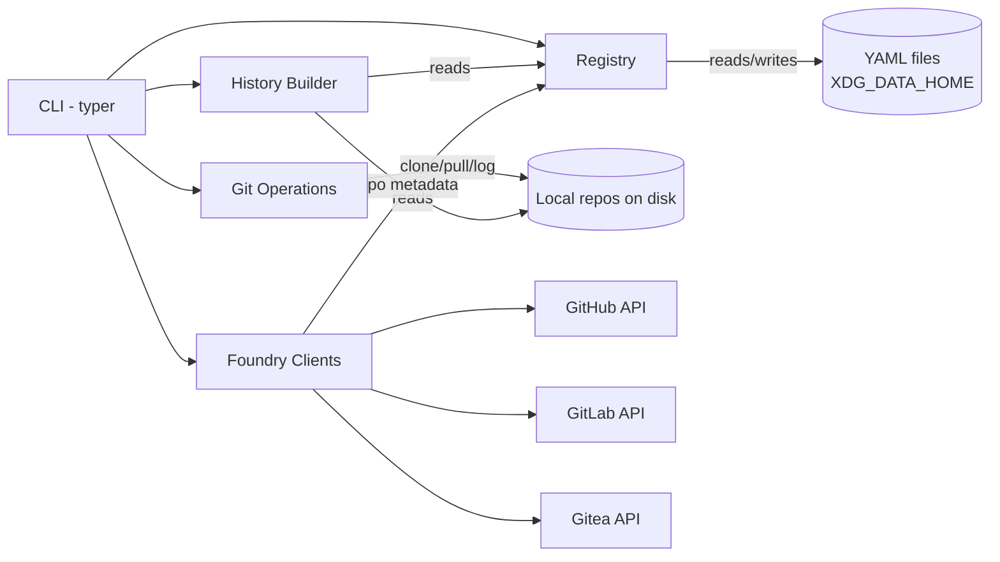

# Architecture: git-projects

## Problem and context

A developer working across multiple git foundries (GitHub, GitLab, self-hosted Gitea) loses track of what they worked on and where. There is no unified view of recent activity across all repositories. This tool provides a local-first CLI that discovers repos via APIs, tracks them locally, and generates activity summaries from git history.

## Goals and non-goals

### Goals

1. Discover repos from GitHub, GitLab, and Gitea APIs — list all, auto-track repos modified in the last 6 months.
2. Clone and track repos locally at a configured base path per foundry.
3. Provide three levels of output: project list (name + path + last modified), brief history (all projects), detailed history (single project).
4. Store all tool state as YAML files under `XDG_DATA_HOME/git-projects/`.
5. Single CLI entry point with subcommands: `sync`, `list`, `clone`, `history`.

### Non-goals

- No web UI or daemon process.
- No direct API-based commit/PR fetching — all history comes from local git log.
- No support for non-git VCS.
- No automatic scheduled runs (user runs manually or via cron).

## System overview

The tool is a local CLI application. On `sync`, it calls foundry APIs to refresh the repo registry, then pulls all cloned repos and scans their git logs. On `list`/`history`, it reads from local state and git repos to produce terminal output. All persistent state lives in YAML files under XDG_DATA_HOME.



## Technology stack

| Component | Technology | Version | Rationale |
|---|---|---|---|
| Language | Python | 3.12+ | Already chosen in pyproject.toml |
| CLI framework | typer | 0.12+ | Already chosen in pyproject.toml |
| HTTP client | httpx | latest | Async-capable, clean API, lighter than requests |
| Git operations | subprocess (git) | — | Avoids heavy deps like GitPython; shell out to `git` directly |
| Data storage | YAML via PyYAML | latest | Human-readable, editable config; no DB overhead |
| XDG paths | platformdirs | latest | Cross-platform XDG_DATA_HOME resolution |
| Date handling | stdlib datetime | — | No need for arrow/pendulum |

## Module boundaries

### `cli` — Command-line interface
- **Owns**: Argument parsing, output formatting, subcommand dispatch.
- **Public interface**: `app` (typer instance) with subcommands `sync`, `list`, `clone`, `history`.
- **Must NOT**: Contain business logic, call git directly, or manage state.

### `registry` — Repo registry and config
- **Owns**: Reading/writing the repo registry YAML, foundry config YAML, tracking state (which repos are tracked, their local paths, last-seen dates).
- **Public interface**: `load_config() -> Config`, `load_registry() -> Registry`, `save_registry(Registry)`, `get_tracked_repos() -> list[Repo]`.
- **Must NOT**: Call APIs or run git commands.
- **Storage layout**:
  ```
  $XDG_DATA_HOME/git-projects/
  ├── config.yaml      # foundry URLs, tokens, clone base paths
  └── registry.yaml    # tracked repos with metadata
  ```

### `foundry` — API clients for repo discovery
- **Owns**: Listing repos from GitHub, GitLab, Gitea APIs. Returns normalized repo metadata.
- **Public interface**: `list_repos(foundry_config: FoundryConfig) -> list[RemoteRepo]`.
- **Must NOT**: Clone repos, modify registry, or read git history.
- **Communication**: Called by CLI during `sync`; results passed to registry for merging.

### `gitops` — Local git operations
- **Owns**: Cloning repos, pulling updates, reading git log.
- **Public interface**: `clone_repo(url, path)`, `pull_repo(path)`, `get_log(path, since: date | None) -> list[Commit]`.
- **Must NOT**: Call foundry APIs or write to registry.

### `history` — History and changelog generation
- **Owns**: Aggregating commits into summaries, grouping by project/date, formatting output.
- **Public interface**: `build_project_list(registry) -> str`, `build_brief_history(registry, repos) -> str`, `build_detailed_history(repo) -> str`.
- **Must NOT**: Call git or APIs directly — receives data from gitops.

### Communication patterns

All communication is **synchronous function calls**. No events, no message queues. The CLI orchestrates:
1. `sync`: foundry → registry → gitops (pull) → registry (update dates)
2. `list`: registry → history (format)
3. `history`: registry → gitops (log) → history (format)

## Key architectural decisions

### Decision: Shell out to `git` instead of using GitPython/pygit2
- **Alternatives considered**: GitPython, pygit2, dulwich.
- **Rationale**: Zero additional binary deps, `git` is always available, parsing `git log` output is straightforward for our use case. Keeps the dependency tree minimal.

### Decision: YAML flat files instead of SQLite
- **Alternatives considered**: SQLite, TinyDB, JSON files.
- **Rationale**: YAML is human-readable and hand-editable — users can fix config or registry without the tool. The dataset is small (hundreds of repos at most). No query complexity warrants a database.

### Decision: httpx instead of requests
- **Alternatives considered**: requests, urllib3.
- **Rationale**: Modern API, better typing, HTTP/2 support. Can go async later if needed without changing the client library.

### Decision: One foundry client per API type, not per instance
- **Alternatives considered**: Separate client classes per foundry instance.
- **Rationale**: GitHub, GitLab, and Gitea each have one API shape. Multiple instances (e.g., two Gitea servers) use the same client with different base URLs. Keeps the client count to three.

### Decision: Auto-track repos modified in last 6 months [ASSUMPTION: 6 months is the right window]
- **Alternatives considered**: Track all, track none by default, user picks.
- **Rationale**: Reduces noise from old/archived repos. Users can manually add/remove repos from tracking.

## Constraints and conventions

- Python 3.12+, type hints everywhere (PEP 604 style).
- Lint with `ruff check --fix`, format with `ruff format`.
- All API tokens read from config YAML or environment variables (`GIT_PROJECTS_GITHUB_TOKEN`, etc.) — never hardcoded.
- `git log` output parsed with `--format` flags, not regex on default output.
- No classes where a function + dataclass will do.
- Use `dataclasses` or plain dicts for internal data; no Pydantic [ASSUMPTION: validation complexity stays low].
- CLI output: plain text with minimal formatting (no rich/tables unless explicitly requested later).

## Open questions

1. **Changelog quality**: Raw commit messages may be noisy. Should we group by date only, or attempt to deduplicate/summarize? Defer to implementation — start with date-grouped commit lists, improve later.
2. **Auth flow**: How to handle token setup for each foundry? Start with config file + env vars, consider `git-projects auth add` command later.
3. **Conflict resolution**: If a repo is discovered on multiple foundries (forks), how to handle? [ASSUMPTION: track as separate entries, user can remove duplicates manually.]
4. **Clone depth**: Should `clone` use `--depth 1` or full clone? Full clone gives complete history but uses more disk. [ASSUMPTION: full clone for complete history.]
