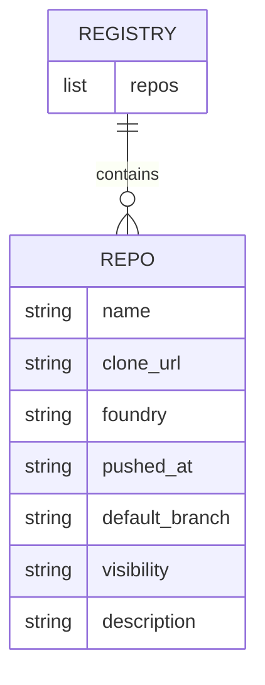
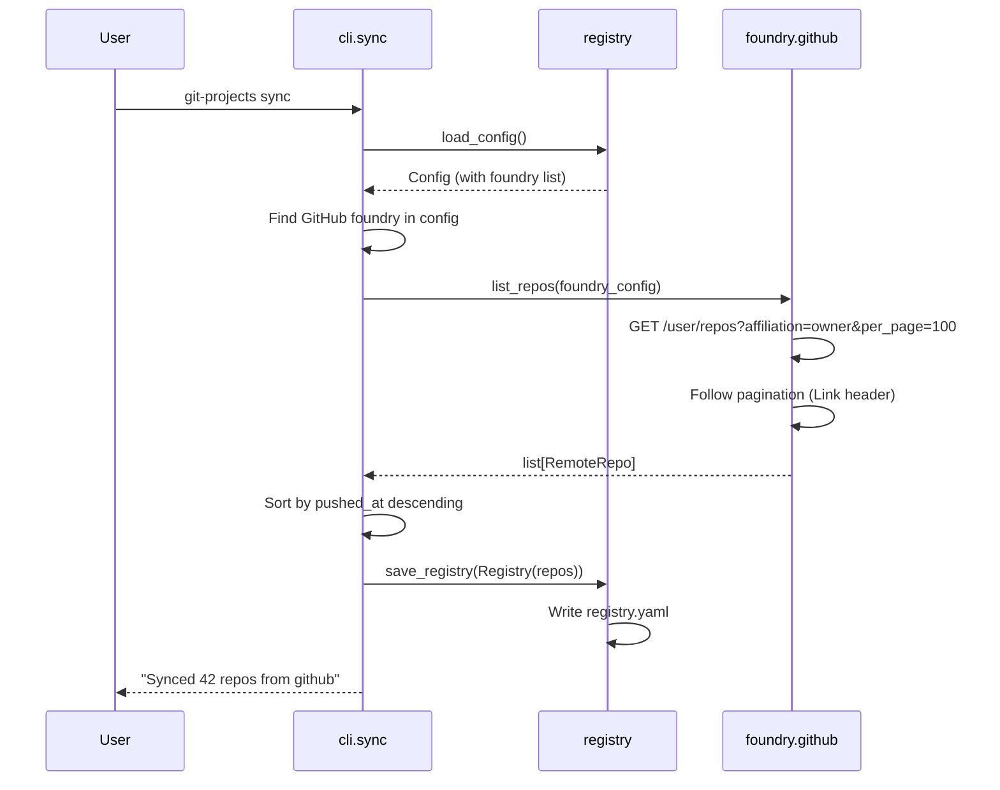
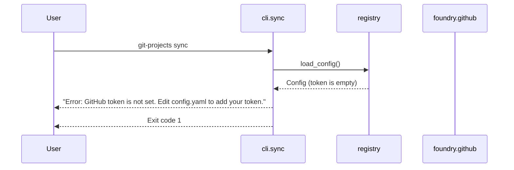

# Design: GitHub Repo Import

## Summary

Adds the ability to fetch all repositories owned by the authenticated GitHub user via the GitHub API and store their metadata in `registry.yaml`. This is the first step of the `sync` pipeline: discovering remote repos and persisting them locally. Repos are stored sorted by last push date (newest first). No cloning, pulling, or filtering happens in this feature.

## Scope

- **In scope**:
  - Implement a GitHub API client that lists all repos owned by the authenticated user.
  - Parse `config.yaml` to extract GitHub foundry config (URL, token).
  - Paginate through all result pages from the GitHub API.
  - Store fetched repo metadata into `registry.yaml` (create file if missing).
  - Store per repo: name, clone URL, foundry name, last pushed date, default branch, visibility, description.
  - Sort repos by last pushed date, newest first.
  - Add a `sync` CLI subcommand that triggers the import.
  - Print a summary line after sync (e.g., "Synced 42 repos from github").

- **Out of scope**:
  - GitLab and Gitea clients (separate features).
  - Cloning or pulling repos.
  - Tracking/untracking logic (6-month filter, manual track/untrack).
  - Scanning git history or building changelogs.
  - Merging with existing registry entries (first sync overwrites; merge is a follow-up).
  - Repos where the user is a collaborator or org member but not owner.

## Acceptance criteria

- AC-01: Running `git-projects sync` with a valid GitHub token in `config.yaml` fetches all owned repos and writes them to `$XDG_DATA_HOME/git-projects/registry.yaml`.
- AC-02: Each repo entry in `registry.yaml` contains the fields: `name`, `clone_url`, `foundry`, `pushed_at`, `default_branch`, `visibility`, `description`.
- AC-03: Repos in `registry.yaml` are sorted by `pushed_at` descending (newest first).
- AC-04: When the GitHub user has more repos than one API page (default 100), all pages are fetched.
- AC-05: Running `git-projects sync` when no config exists exits with non-zero code and prints a message telling the user to run `config init`.
- AC-06: Running `git-projects sync` when the GitHub token is empty exits with non-zero code and prints a message about the missing token.
- AC-07: Running `git-projects sync` when the GitHub API returns an auth error (401) exits with non-zero code and prints a message about the invalid token.
- AC-08: Running `git-projects sync` prints a summary line: "Synced {n} repos from github".
- AC-09: `registry.yaml` uses the clone URL format `https://github.com/{owner}/{repo}.git` (the `clone_url` field from the API).
- AC-10: The `description` field is stored as an empty string when the repo has no description (not null/None).

## Data model changes

`registry.yaml` is a new file created by this feature.

```yaml
# $XDG_DATA_HOME/git-projects/registry.yaml
repos:
  - name: my-recent-project
    clone_url: https://github.com/user/my-recent-project.git
    foundry: github
    pushed_at: "2026-02-20T14:30:00Z"
    default_branch: main
    visibility: public
    description: "A cool project"
  - name: older-project
    clone_url: https://github.com/user/older-project.git
    foundry: github
    pushed_at: "2025-11-01T08:00:00Z"
    default_branch: main
    visibility: private
    description: ""
```



## Execution flow

### Happy path — sync GitHub repos



### Error path — invalid or missing token



## API / interface changes

### `registry.load_config`

```python
@dataclass
class FoundryConfig:
    name: str
    type: str
    url: str
    token: str

@dataclass
class Config:
    clone_root: str
    foundries: list[FoundryConfig]

def load_config() -> Config:
    """Load and parse config.yaml."""
```

- **Returns**: `Config` dataclass.
- **Raises**: `FileNotFoundError` when `config.yaml` does not exist.

### `registry.save_registry`

```python
@dataclass
class Repo:
    name: str
    clone_url: str
    foundry: str
    pushed_at: str
    default_branch: str
    visibility: str
    description: str

@dataclass
class Registry:
    repos: list[Repo]

def save_registry(registry: Registry) -> Path:
    """Write registry to registry.yaml and return its path."""
```

- **Returns**: `Path` — absolute path to `registry.yaml`.

### `foundry.github.list_repos`

```python
@dataclass
class RemoteRepo:
    name: str
    clone_url: str
    pushed_at: str
    default_branch: str
    visibility: str
    description: str

def list_repos(config: FoundryConfig) -> list[RemoteRepo]:
    """Fetch all owned repos from the GitHub API."""
```

- **Input validation**: Raises `ValueError` if `config.token` is empty.
- **HTTP errors**: Raises `httpx.HTTPStatusError` on 401/403/etc. The CLI layer catches and prints a user-friendly message.
- **Pagination**: Follows `Link: <url>; rel="next"` headers until exhausted.
- **API call**: `GET {config.url}/user/repos?affiliation=owner&sort=pushed&direction=desc&per_page=100`.

### `cli.sync` command

```python
@app.command()
def sync() -> None:
    """Fetch repos from configured foundries and update the registry."""
```

- On success: prints summary, exits 0.
- On missing config: prints error suggesting `config init`, exits 1.
- On empty token: prints error about missing token, exits 1.
- On API auth error: prints error about invalid token, exits 1.

## Affected modules

| Module | Change |
|---|---|
| `registry` | Add `load_config() -> Config`, `save_registry(Registry) -> Path`, dataclasses `Config`, `FoundryConfig`, `Repo`, `Registry`. |
| `foundry` (new) | New module `src/git_projects/foundry/github.py` with `list_repos(FoundryConfig) -> list[RemoteRepo]` and `RemoteRepo` dataclass. |
| `cli` | Add `sync` command that orchestrates config loading, repo fetching, and registry saving. |

[ARCH CHANGE NEEDED: The architecture doc defines `foundry` as a single module with one public function `list_repos(foundry_config)`. This design creates `foundry/` as a package with `foundry/github.py` to allow adding `gitlab.py` and `gitea.py` later without bloating a single file. The public interface remains the same.]

## Implementation notes

- Use `httpx.Client` (sync) — no need for async at this stage.
- Parse the `Link` response header for pagination. The GitHub API returns `Link: <url>; rel="next"` when there are more pages. Stop when no `next` link is present.
- The GitHub API sorts by `pushed` natively (`sort=pushed&direction=desc`), but we still sort in Python after collecting all pages to guarantee correct global order.
- Use `PyYAML` for reading `config.yaml` and writing `registry.yaml`. Since `registry.yaml` has no comments to preserve, programmatic YAML generation is fine here (unlike `config.yaml`).
- Map `null` description from the API to `""` to keep the YAML clean.
- The `foundry/` package needs an `__init__.py`.
- Set a `User-Agent` header on httpx requests (e.g., `git-projects/0.1`).
- Set a reasonable timeout (10s connect, 30s read) on the httpx client.

## Open questions

None — all questions resolved during clarification.
