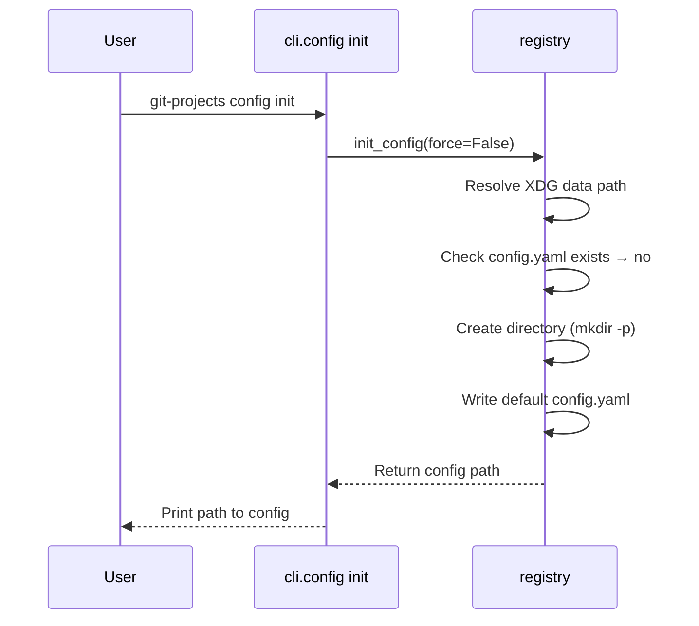
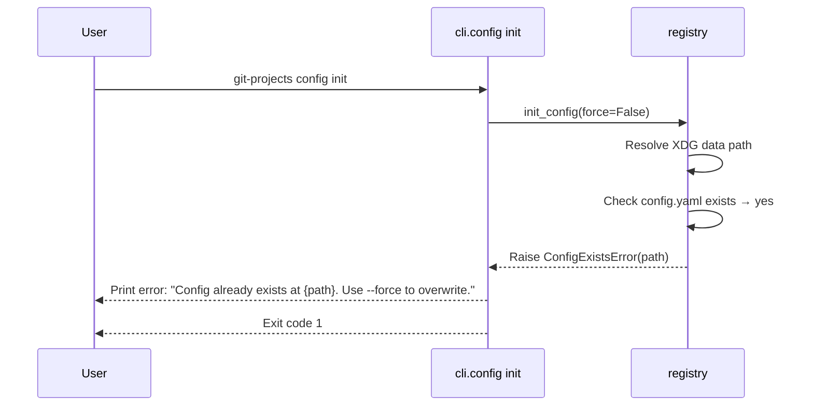
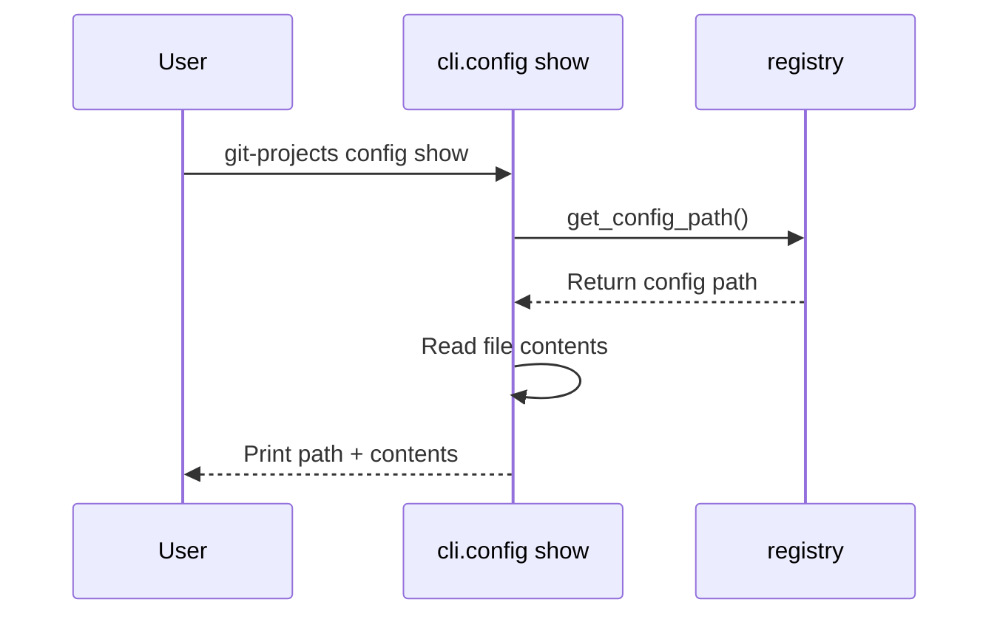
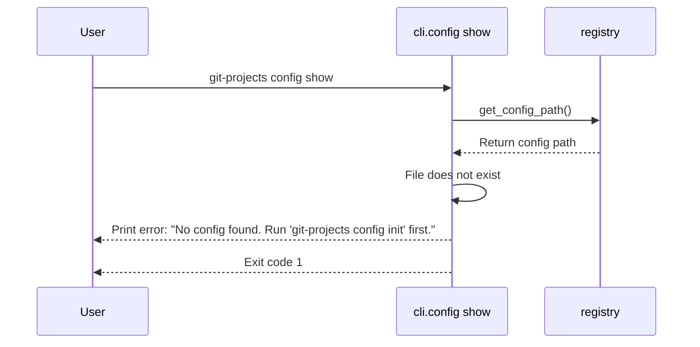

# Design: `config` CLI Command Group

## Summary

The `config` command group manages git-projects configuration. It contains two subcommands: `config init` bootstraps a new installation by creating the XDG data directory and writing a default `config.yaml` with placeholder foundry entries. `config show` displays the config file path and prints its contents, giving users a quick way to inspect their setup without hunting for the file.

## Scope

- **In scope**:
  - `config init`: Create `$XDG_DATA_HOME/git-projects/` directory (and parents) if missing.
  - `config init`: Write a default `config.yaml` into that directory.
  - `config init`: Print the path to the created config file.
  - `config init`: Refuse with an error message when `config.yaml` already exists (no `--force`).
  - `config init`: `--force` flag to overwrite an existing config.
  - `config show`: Print the absolute config path and the file contents to stdout.
  - `config show`: Error when no config exists yet.

- **Out of scope**:
  - Creating `registry.yaml` (created by `sync`).
  - Validating tokens or network connectivity.
  - Interactive prompts or wizards.
  - Accepting CLI arguments to pre-fill config values (e.g., `--clone-root`).
  - Editing config from the CLI.

## Acceptance criteria

- AC-01: Running `git-projects config init` when no config exists creates `$XDG_DATA_HOME/git-projects/config.yaml` with the default content defined in the architecture doc.
- AC-02: Running `git-projects config init` when no config exists creates the `$XDG_DATA_HOME/git-projects/` directory if it does not already exist.
- AC-03: Running `git-projects config init` prints the absolute path of the created config file to stdout.
- AC-04: Running `git-projects config init` when `config.yaml` already exists exits with a non-zero exit code and prints a message stating the config already exists, without modifying the file.
- AC-05: Running `git-projects config init --force` when `config.yaml` already exists overwrites it with the default config and prints the path.
- AC-06: The default `config.yaml` content matches the template specified in the architecture doc (`clone_root`, `foundries` list with GitHub entry and commented-out GitLab/Gitea examples).
- AC-07: Running `git-projects config show` when config exists prints the config file path on the first line followed by the file contents.
- AC-08: Running `git-projects config show` when no config exists exits with a non-zero exit code and prints a message telling the user to run `config init`.
- AC-09: Running `git-projects config` with no subcommand shows help listing `init` and `show`.

## Data model changes

None. The `config.yaml` schema is already defined in the architecture doc under the `registry` module. No new entities or fields.

## Execution flow

### Happy path — first-time config init



### Error path — config already exists (no --force)



### Happy path — config show



### Error path — config show with no config



## API / interface changes

### `registry.init_config`

```python
def init_config(*, force: bool = False) -> Path:
    """Create default config.yaml and return its path."""
```

- **Parameters**: `force` — if `True`, overwrite existing config; if `False`, raise on existing.
- **Returns**: `Path` — absolute path to the written `config.yaml`.
- **Raises**: `ConfigExistsError` — when config exists and `force` is `False`.

### `registry.get_config_path`

```python
def get_config_path() -> Path:
    """Return the absolute path to config.yaml (may not exist yet)."""
```

- **Returns**: `Path` — absolute path to `config.yaml`.

### `registry.ConfigExistsError`

```python
class ConfigExistsError(Exception):
    def __init__(self, path: Path) -> None: ...
    path: Path
```

### `cli` — config command group

```python
config_app = typer.Typer(no_args_is_help=True)
app.add_typer(config_app, name="config", help="Manage configuration.")
```

### `cli.config init` command

```python
@config_app.command()
def init(
    force: Annotated[
        bool,
        typer.Option("--force", "-f", help="Overwrite existing config."),
    ] = False,
) -> None:
    """Create default config file."""
```

- On success: prints path, exits 0.
- On `ConfigExistsError`: prints error message, exits 1 via `typer.Exit(code=1)`.

### `cli.config show` command

```python
@config_app.command()
def show() -> None:
    """Show config file path and contents."""
```

- On success: prints path on first line, then file contents, exits 0.
- On missing config: prints error message suggesting `config init`, exits 1.

## Affected modules

| Module | Change |
|---|---|
| `registry` | Add `init_config(*, force: bool) -> Path`, `get_config_path() -> Path`, `ConfigExistsError` exception, and `DEFAULT_CONFIG` constant holding the YAML template string. |
| `cli` | Add `config` typer subgroup with `init` and `show` commands. Remove placeholder `hello` command. |

## Implementation notes

- Use `platformdirs.user_data_path("git-projects")` to resolve the XDG data directory.
- Write the default config as a raw string constant (`DEFAULT_CONFIG`) rather than constructing YAML programmatically — the template includes comments for commented-out foundries, which PyYAML would strip.
- Use `Path.mkdir(parents=True, exist_ok=True)` for directory creation.
- Check existence with `Path.exists()` before writing (when `force=False`).
- The `registry` module will be a new file: `src/git_projects/registry.py`.
- The `config` group uses `typer.Typer(no_args_is_help=True)` so bare `git-projects config` shows help.
- `config show` reads the file directly with `Path.read_text()` — no need to parse YAML since we're just displaying it.

## Open questions

None — all questions resolved during clarification.
